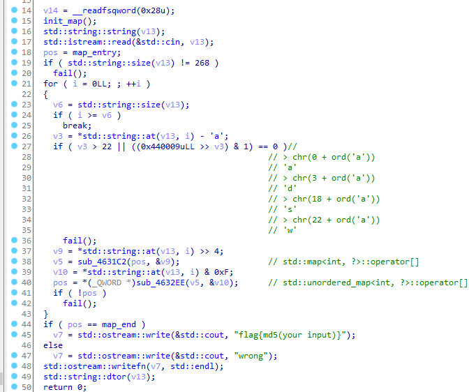

程序拖入 ida ，很容易看出是一个 strip 的 C++ 静态编译程序，并且没开优化， main 逻辑很少，很容易逆完：



识别出来是个迷宫题，表示迷宫位置的结构是一个 `map<int, unordered_map<int, ?>>` ，? 表示自身类型的一个指针，输入的高 4 bit 和低 4 bit 分别作为两个 map 的下标值进行索引，这样到达下一个位置。

init_map 函数太大了，没法反编译，显然是不可能静态分析的。要提取出迷宫信息只能通过调试写代码解析内存，这里使用 gdb 调试 dump ：

```
(gdb) b *0x462D8C
Breakpoint 1 at 0x462d8c
(gdb) r
Starting program: mapmap2

Breakpoint 1, 0x0000000000462d8c in ?? ()
1: x/i $pc
=> 0x462d8c:    lea    rax,[rbp-0x40]
(gdb) x/2gx 0x63F530
0x63f530:       0x000000000065b3d0      0x0000000000667b50
(gdb) info proc mappings
process 2714
Mapped address spaces:

          Start Addr           End Addr       Size     Offset  Perms  objfile
            0x400000           0x401000     0x1000        0x0  r--p   mapmap2
            0x401000           0x5d9000   0x1d8000     0x1000  r-xp   mapmap2
            0x5d9000           0x632000    0x59000   0x1d9000  r--p   mapmap2
            0x632000           0x63d000     0xb000   0x231000  r--p   mapmap2
            0x63d000           0x640000     0x3000   0x23c000  rw-p   mapmap2
            0x640000           0x730000    0xf0000        0x0  rw-p   [heap]
      0x7ffff7ff9000     0x7ffff7ffd000     0x4000        0x0  r--p   [vvar]
      0x7ffff7ffd000     0x7ffff7fff000     0x2000        0x0  r-xp   [vdso]
      0x7ffffffde000     0x7ffffffff000    0x21000        0x0  rw-p   [stack]
(gdb) dump memory heap 0x640000 0x730000
(gdb)
```

上面 `x/2gx 0x63F530` 得到 map_entry 与 map_end 指针，后面 dump 堆内存。之后就可以写脚本解析 stl 结构构建出表示该迷宫的一个图，调库得到最短路径即可，详细代码见 exp 。

```python
#!/usr/bin/env python3

'''
(gdb) b *0x462D8C
Breakpoint 1 at 0x462d8c
(gdb) r
Starting program: mapmap2

Breakpoint 1, 0x0000000000462d8c in ?? ()
1: x/i $pc
=> 0x462d8c:    lea    rax,[rbp-0x40]
(gdb) x/2gx 0x63F530
0x63f530:       0x000000000065b3d0      0x0000000000667b50
(gdb) info proc mappings
process 2714
Mapped address spaces:

          Start Addr           End Addr       Size     Offset  Perms  objfile
            0x400000           0x401000     0x1000        0x0  r--p   mapmap2
            0x401000           0x5d9000   0x1d8000     0x1000  r-xp   mapmap2
            0x5d9000           0x632000    0x59000   0x1d9000  r--p   mapmap2
            0x632000           0x63d000     0xb000   0x231000  r--p   mapmap2
            0x63d000           0x640000     0x3000   0x23c000  rw-p   mapmap2
            0x640000           0x730000    0xf0000        0x0  rw-p   [heap]
      0x7ffff7ff9000     0x7ffff7ffd000     0x4000        0x0  r--p   [vvar]
      0x7ffff7ffd000     0x7ffff7fff000     0x2000        0x0  r-xp   [vdso]
      0x7ffffffde000     0x7ffffffff000    0x21000        0x0  rw-p   [stack]
(gdb) dump memory heap 0x640000 0x730000
(gdb)
'''

# map<int, unordered_map<int, void*>>*
map_entry = 0x65b3d0
map_exit = 0x667b50

heap_base = 0x640000

heap = open('./heap', 'rb').read()
def get_bytes_at(addr, size):
    assert addr >= heap_base and addr + size <= heap_base + len(heap)
    return heap[addr - heap_base: addr - heap_base + size]

def get_number_at(addr, size):
    return int.from_bytes(get_bytes_at(addr, size), 'little')

def get_dword_at(addr):
    return get_number_at(addr, 4)

def get_qword_at(addr):
    return get_number_at(addr, 8)

def map_get_parent(node):
    return get_qword_at(node + 0x8)

def map_get_left(node):
    return get_qword_at(node + 0x10)

def map_get_right(node):
    return get_qword_at(node + 0x18)

def map_get_successor(map, node):
    nil = map + 8
    right = map_get_right(node)
    if right != 0 and right != nil: # right->left->left->...
        parent = right
        while True:
            left = map_get_left(parent)
            if left == nil or left == 0: return parent
            parent = left
    else: # node->parent->left == node: node->parent
        parent = map_get_parent(node)
        while map_get_right(parent) == node:
            node = parent
            parent = map_get_parent(node)
        return parent

def map_get_key(node):
    return get_dword_at(node + 0x20)

def map_get_value(node):
    return node + 0x28

def map_get_items(map):
    items = []
    nil = map + 0x08
    root = get_qword_at(map + 0x10)
    if root == 0 or root == nil: return items
    min = get_qword_at(map + 0x18)
    max = get_qword_at(map + 0x20)
    iter = min
    items.append(iter)
    while iter != max:
        iter = map_get_successor(map, iter)
        items.append(iter)
    return items

def unordered_map_get_items(map):
    items = []
    iter = get_qword_at(map + 0x10)
    while iter != 0:
        items.append(iter)
        iter = get_qword_at(iter)
    return items

def unordered_map_get_key(node):
    return get_dword_at(node + 0x8)

def unordered_map_get_value(node):
    return get_dword_at(node + 0x10)

'''
print(hex(map_entry))
for item in map_get_items(map_entry):
    y = map_get_key(item)
    for item in unordered_map_get_items(map_get_value(item)):
        x = unordered_map_get_key(item)
        value = unordered_map_get_value(item)
        print((y, x), hex(value))
'''


import networkx as nx

G = nx.DiGraph()
nodes = {}
nodes_to_process = {map_entry}
nodes_processed = set()
while nodes_to_process:
    node = nodes_to_process.pop()
    nodes_processed.add(node)
    for item in map_get_items(node):
        h = map_get_key(item)
        for item in unordered_map_get_items(map_get_value(item)):
            l = unordered_map_get_key(item)
            _node = unordered_map_get_value(item)
            if _node == 0: continue # NULL
            if _node not in nodes_processed and _node not in nodes_to_process:
                nodes_to_process.add(_node)
                if node not in nodes: nodes[node] = {}
                nodes[node][_node] = (h << 4) | l
            G.add_edge(node, _node)

path = nx.shortest_path(G, map_entry, map_exit)
input = []
for i in range(len(path) - 1):
    a = path[i]
    b = path[i + 1]
    input.append(nodes[a][b])
input = bytes(input)

print(input)
# ddssaassddddssddssssaassaawwwwwwaassssssssssddssssssddwwddddssssddssssddwwwwddssddwwddssddwwwwwwwwwwaawwaawwddwwaaaawwwwddwwddssddddddssaassaassddssddwwddwwwwwwwwwwwwddssssssssssddddssssssddwwwwwwddssddssaassssddssssaaaawwwwaassssaawwaassssssddddssssddssssssaassdddddd
assert len(input) == 268
from hashlib import md5
print('SUCTF{%s}' % md5(input).hexdigest())
# SUCTF{8b587367b99e5e2fcbdb6598da14b9bc}

```